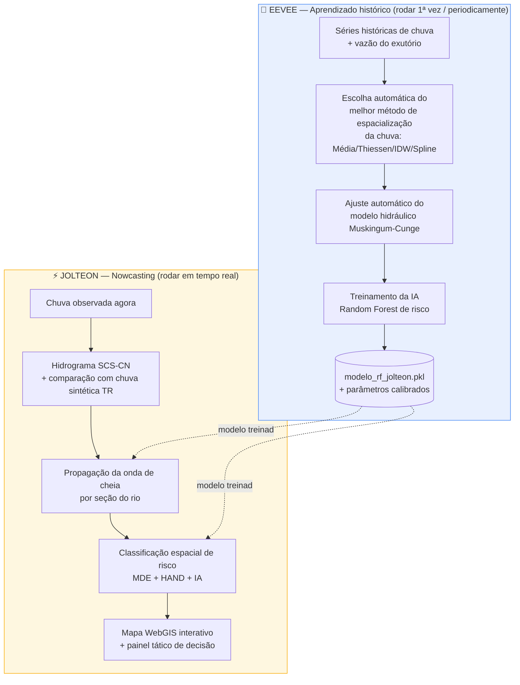

# 🌧️ EEVEE & JOLTEON — Sistema de previsão e monitoramento de heias urbanas

> Produto de uma dissertação de mestrado — Mestrado Profissional em Engenharia Hídrica da UNIFEI
> Sistema de aprendizado histórico + nowcasting tático para alerta de   cheias em bacia urbana.

Este repositório reúne o código-fonte de um **sistema de previsão probabilistica e alerta em webGIS de cheias urbanas** dividido em dois módulos complementares: um que
**aprende com o histórico** da bacia (EEVEE) e outro que **monitora em
tempo real** usando esse aprendizado (JOLTEON).

---

## 🧭 Visão geral em uma imagem



**Em uma frase:** o EEVEE aprende com o histórico da bacia e calibra o
sistema; o JOLTEON usa esse aprendizado para prever, em tempo real, onde e
quando o próximo alagamento pode acontecer.

📖 Para uma explicação passo a passo de cada técnica usada (com fórmulas,
glossário e o porquê de cada escolha metodológica), veja
**[docs/METODOLOGIA.md](docs/METODOLOGIA.md)**.

---

## 📦 Os dois módulos

### 1. `eevee_rev_7.py` — EEVEE
**E**xtrator de **E**ventos e **V**ariáveis de **E**scoamento **E**xtremo

Pipeline de **preparação e aprendizado histórico**. Resumo do que faz:

1. Sincroniza e limpa os dados das estações pluviométricas e da estação
   fluviométrica de exutório.
2. Testa 4 métodos de espacialização da chuva e escolhe automaticamente o
   de menor erro (RMSE).
3. Gera o cenário de chuva de projeto (pior dia observado) e corrige o
   raster HAND.
4. Faz o ajuste automaticamente através de AG do modelo de propagação de onda de cheia
   (Muskingum-Cunge) por otimização numérica.
5. Treina uma **Random Forest** para classificar risco de alagamento
   (seco / histórico / severo), avaliando por OOB score e importância de
   variáveis.
6. Gera relatórios interativos em Plotly (hidrogramas e propagação da onda).

➡️ **Saída principal:** modelo de IA treinado + parâmetros hidráulicos
ajustados para o rio estudado, usados pelo JOLTEON.

### 2. `J0LT30N_REV13.py` — JOLTEON
**J**oint **O**bservational **T**ool for **E**xtreme **O**verland **N**owcasting **S**ystem

Pipeline de **nowcasting**, que consome o que o EEVEE aprendeu:

1. Carrega o modelo treinado e a calibração hidráulica do EEVEE.
2. Gera o hidrograma da chuva observada (método SCS-CN) e compara com uma
   tempestade sintética de referência (curva IDF de Curitiba no exemplo apresentado).
3. Propaga a onda de cheia seção por seção (calculadas por AG) do rio (Muskingum-Cunge).
4. Classifica o risco espacial (pluvial / fluvial / misto) cruzando
   terreno (MDE/HAND) com a probabilidade prevista pela IA.
5. Gera um **mapa interativo (WebGIS/Folium)** com bairros, rede de
   drenagem, seções de controle e pontos de risco.
6. Imprime um **painel**: veredito de risco, gargalo hidráulico
   crítico, tempo estimado até o pico em cada seção e ação recomendada
   (evacuar / alerta / monitorar / seguro).

➡️ **Saída principal:** mapa interativo + relatório para de decisão.

---

## 🗂️ Estrutura do repositório

```
.
├── eevee_rev_7.py          # Módulo 1 — aprendizado histórico e calibração
├── J0LT30N_REV13.py        # Módulo 2 — nowcasting operacional
├── requirements.txt        # Dependências Python
├── docs/
│   └── METODOLOGIA.md      # Explicação técnica detalhada de cada etapa
├── dados/                  # Não versionado — ver dados/README.md
└── README.md                # Este arquivo
```

## ⚙️ Como executar

```bash
git clone <url-do-seu-repositorio>
cd <nome-do-repositorio>
python -m venv .venv && source .venv/bin/activate   # (Windows: .venv\Scripts\activate)
pip install -r requirements.txt
```

Monte a pasta `dados/` conforme descrito em **[dados/README.md](dados/README.md)**
(os caminhos dentro dos scripts já são relativos a essa pasta — não é
necessário editar nada se os dados forem colocados lá).

Rode primeiro o EEVEE, para calibrar o modelo e treinar a IA:
```bash
python eevee_rev_7.py
```

Depois rode o JOLTEON, que consome o modelo treinado:
```bash
python J0LT30N_REV13.py
```

## 🧠 Contexto acadêmico

Este código foi desenvolvido como um produto de uma dissertação de mestrado
(Mestrado Profissional em Engenharia Hídrica — UNIFEI), aplicado a um estudo de caso de bacia
hidrográfica urbana. Os dados de entrada (séries pluviométricas,
fluviométricas e camadas geoespaciais da bacia) não estão incluídos neste
repositório por serem específicos do estudo de caso.

## 🧪 Agradecimentos

O presente trabalho foi realizado com apoio da Coordenação de Aperfeiçoamento de Pessoal de Nível Superior – Brasil (CAPES), por meio do apoio ao Programa de Pós-Graduação em Recursos Hídricos e com apoio do CNPq, por meio dos projetos  CNPq 307637/2012-3 de Produtividade em Pesquisa e (5) CNPq/MCTI/FNDCT Nº 59/2022 – Benefícios da implementação de técnicas compensatórias para mitigar os problemas causados pelas mudanças climáticas, por meio da gestão dos aspectos qualitativos e quantitativos da drenagem urbana no Município de Curitiba – Paraná – Brasil.

## 📄 Licença

Código em teste, uso acadêmico. Em caso de uso, utilizar a seguinte referência:

GONÇALVES, Franz Costa; DE MACEDO, Marina Batalini; FAVA, Maria Clara. Aplicação híbrida de método físico e Machine Learning para o mapeamento de inundações
e desastres hidrológicos. 2026. 114f. Dissertação (Mestrado Profissional em Engenharia Hídrica) - Universidade Federal de Itajubá, Itajubá, 2026.

Todos os direitos reservados - MPEH/UNIFEI.
