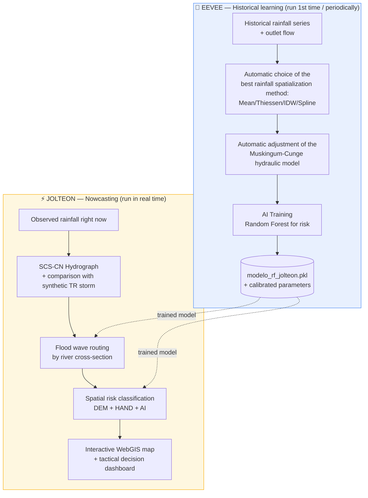

# 🌧️ EEVEE & JOLTEON — Urban flood forecasting and monitoring system

> Product of a Master's thesis — Professional Master's in Water Resources Engineering at UNIFEI
> Historical learning system + tactical nowcasting for urban basin flood warnings.

This repository gathers the source code for a **probabilistic forecasting and WebGIS warning system for urban floods**, divided into two complementary modules: one that **learns from the basin's history** (EEVEE) and another that **monitors in real-time** using that learning (JOLTEON).

---

## 🧭 Overview in one image



**In one sentence:** EEVEE learns from the basin's history and calibrates the system; JOLTEON uses this learning to predict, in real-time, where and when the next flood might happen.

📖 For a step-by-step explanation of each technique used (with formulas, glossary, and the reasoning behind each methodological choice), see **[docs/METODOLOGIA_EN.md](docs/METODOLOGIA_EN.md)**.

---

## 📦 The two modules

### 1. `eevee_rev_7.py` — EEVEE
**E**xtrator de **E**ventos e **V**ariáveis de **E**scoamento **E**xtremo (Extractor of Events and Extreme Runoff Variables)

**Historical learning and preparation** pipeline. Summary of what it does:

1. Synchronizes and cleans data from rainfall stations and the outlet stream gauge.
2. Tests 4 rainfall spatialization methods and automatically chooses the one with the lowest error (RMSE).
3. Generates the design storm scenario (worst observed day) and corrects the HAND raster.
4. Automatically adjusts the flood wave routing model (Muskingum-Cunge) through Genetic Algorithms (GA) by numerical optimization.
5. Trains a **Random Forest** AI to classify flood risk (dry / historical / severe), evaluating it via OOB score and feature importance.
6. Generates interactive Plotly reports (hydrographs and wave routing).

➡️ **Main output:** trained AI model + adjusted hydraulic parameters for the studied river, to be used by JOLTEON.

### 2. `J0LT30N_REV13.py` — JOLTEON
**J**oint **O**bservational **T**ool for **E**xtreme **O**verland **N**owcasting **S**ystem

**Nowcasting** pipeline, which consumes what EEVEE has learned:

1. Loads the trained model and hydraulic calibration from EEVEE.
2. Generates the observed rainfall hydrograph (SCS-CN method) and compares it with a reference synthetic storm (Curitiba IDF curve in the presented example).
3. Routes the flood wave cross-section by cross-section (calculated by GA) of the river (Muskingum-Cunge).
4. Classifies the spatial risk (pluvial / fluvial / mixed) by crossing terrain data (DEM/HAND) with the probability predicted by the AI.
5. Generates an **interactive map (WebGIS/Folium)** with neighborhoods, drainage network, control sections, and risk points.
6. Prints a **dashboard**: risk verdict, critical hydraulic bottleneck, estimated time to peak in each section, and recommended action (evacuate / alert / monitor / safe).

➡️ **Main output:** interactive map + decision-making report.

---

## 🗂️ Repository structure

```
.
├── eevee_rev_7.py          # Module 1 — historical learning and calibration
├── J0LT30N_REV13.py        # Module 2 — operational nowcasting
├── requirements.txt        # Python dependencies
├── docs/
│   └── METODOLOGIA.md      # Detailed technical explanation of each step
├── dados/                  # Not versioned — see dados/README.md
└── README.md               # This file
```

## ⚙️ How to run

```bash
git clone <your-repository-url>
cd <repository-name>
python -m venv .venv && source .venv/bin/activate   # (Windows: .venv\Scriptsctivate)
pip install -r requirements.txt
```

Mount the `dados/` folder as described in **[dados/README.md](dados/README.md)** (the paths inside the scripts are already relative to this folder — there is no need to edit anything if the data is placed there).

Run EEVEE first to calibrate the model and train the AI:
```bash
python eevee_rev_7.py
```

Then run JOLTEON, which consumes the trained model:
```bash
python J0LT30N_REV13.py
```

## 🧠 Academic context

This code was developed as a product of a Master's thesis (Professional Master's in Water Resources Engineering — UNIFEI), applied to an urban watershed case study. The input data (rainfall and streamflow series, and geospatial basin layers) are not included in this repository because they are specific to the case study.

## 🧪 Acknowledgments

This work was carried out with the support of the Coordenação de Aperfeiçoamento de Pessoal de Nível Superior – Brasil (CAPES), through support for the Graduate Program in Water Resources, and with the support of CNPq, through the Research Productivity projects CNPq 307637/2012-3 and (5) CNPq/MCTI/FNDCT No. 59/2022 – Benefits of implementing compensatory techniques to mitigate the problems caused by climate change, through the management of qualitative and quantitative aspects of urban drainage in the Municipality of Curitiba – Paraná – Brazil.

## 📄 License

Code under testing; for academic use. If used, please cite as follows:

GONÇALVES, Franz Costa; DE MACEDO, Marina Batalini; FAVA, Maria Clara. Aplicação híbrida de método físico e Machine Learning para o mapeamento de inundações e desastres hidrológicos. 2026. 114f. Dissertação (Mestrado Profissional em Engenharia Hídrica) - Universidade Federal de Itajubá, Itajubá, 2026.

All rights reserved - MPEH/UNIFEI.
